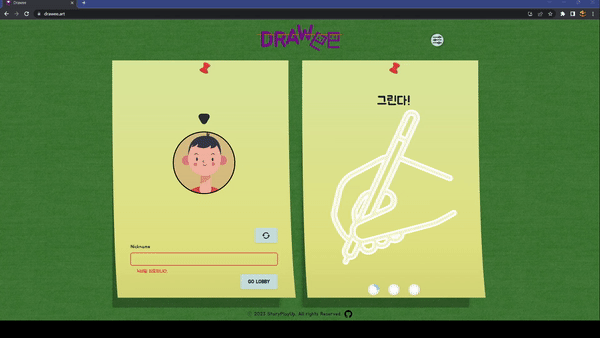
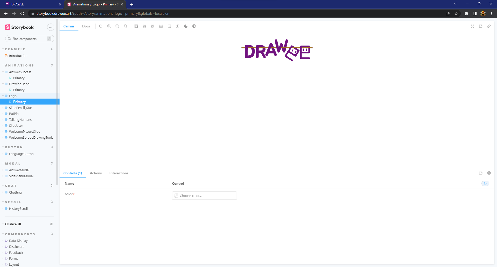

# DRAWEE

<aside>
🔥 **협동 조합 게임!**

다른 사람들과 함께 그림을 그리고 정답을 맞춰보세요!

협동 조합 게임은 팀을 짜고 함께 그림을 그리는 게임 입니다.

팀원이 제시어를 보고 그리면 나머지 한명이 그림을 보고 제시어를 맞추는 방식입니다.

</aside>

### General

---

**Project timeline:** Dec 2022 - Feb 2023
**Project Name:** “DRAWEE”
**Vendor:** StartPlayUp

### Tech

---

Client : Recoil, React, Nextjs, Framer-motion, typescript, chakra, i18n, pwa, webRtc, Tldraw

Server : socket,

Game Sturcture : YJS

CI/CD : TurboRepo, EC2, github Action,

### Project Goals

---

# WebRTC

Yjs 기반으로 채팅 및 그림 공유 게임 제작

# i18n

next-i18n 을 사용하여 국제화(English)에 대응함

# Next.JS

사전렌더링을 통한 검색엔진 최적화를 위해 Next.JS를 사용함

# MonoRepo

turboRepo를 사용하여 모노레포를 구성하였으며,

프로젝트 유지보수 및 관리를 용이하게 하였음

# Framer-motion

framer-motion으로 다양한 애니메이션 동작을 구현함

# Vercel

Vercel을 통해 배포하였으며, 관련 도메인도 vercel을 통해 관리함.

# **Team**

.png>)

### [장석찬](https://github.com/jsc7727) : TurboRepo 활용하여 프로젝트 기반과 기초 설계, Yjs, Tldraw 활용, 로비 페이지, SCSS, Drawee 모드 제작, Vercel 활용한 배포\*\*

### [정진](https://github.com/TypingOK) : 메인 페이지, 이어달리기 모드, 게임 결과 페이지 제작, PWA 및 SEO 최적화, 다국어 지원\*\*

### **Common : React-Framer 사용하여 CSS, SVG 애니메이션 제작**

# 구현한 화면

## 사이트 소개 페이지

.gif>)

## **로비 화면**

## **다크모드**

.gif>)

## **다국어 지원**

.gif>)

브라우저 영어이 영어로 되어있는 경우 locale을 자동으로 확인하여 영어 페이지로 리다이렉트 됨

## 방장의 초대 기능

.gif>)

## 게임 선택 기능과 채팅 기능

.gif>)

## Drawee 게임

.gif>)

.gif>)

%201.gif>)

게임 시작과 문제 제출, 그림 그리기, 정답 제출, 결과 페이지

## 이어달리기 모드

.gif>)

## 스토리 북

# Learning Stack

## [monorepo](https://github.com/coop-game/coop/blob/main/document/monorepo.md)

## [turborepo](https://github.com/coop-game/coop/blob/main/document/turborepo.md)

## [next-pwa](https://github.com/coop-game/coop/blob/main/document/next-pwa.md)

## [next_i18next](https://github.com/coop-game/coop/blob/main/document/next_i18next.md)

## [next_seo](https://github.com/coop-game/coop/blob/main/document/next_seo.md)

## [storybook](https://github.com/coop-game/coop/blob/main/document/storybook.md)

## [turborepo](https://github.com/coop-game/coop/blob/main/document/turborepo.md)

## [useInView](https://github.com/coop-game/coop/blob/main/document/useInView.md)
