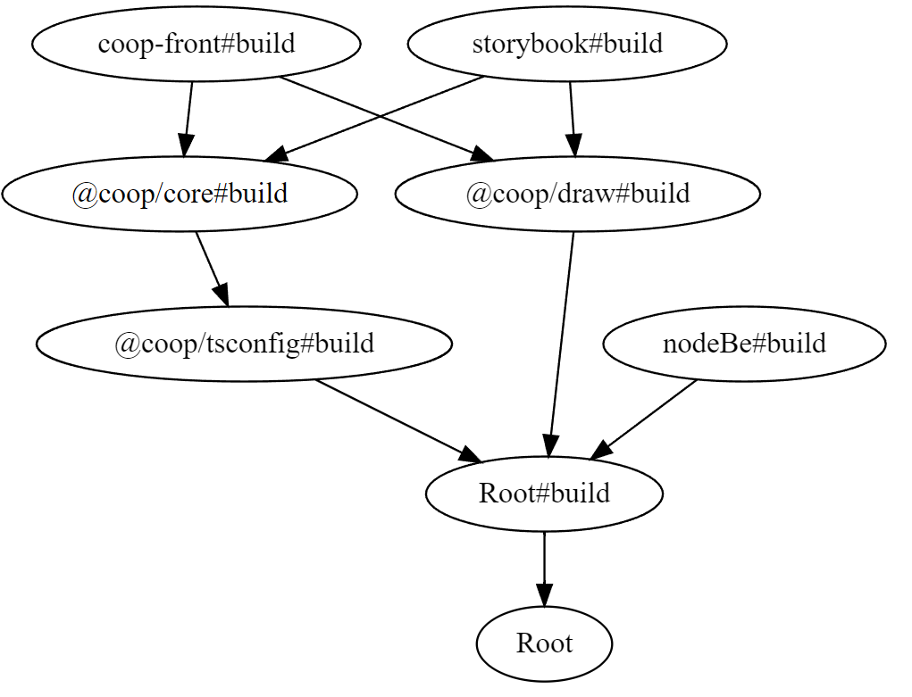

# turbo repo 란?

Turborepo는 JavaScript 및 TypeScript 코드베이스에 최적화된 빌드 시스템이다.

코드베이스는 `lint`, `build`, `test` 와 같은 작업들이며,
터보레포를 쓰면 캐시를 활용 할 수 있고 병렬로 처리가 가능하다는 장점이 있다.

새로운 버전 `turbo pack`도 있는데 클라우드에서 처리하고 돈을 받는 모델로 구성되어 있다.

# turbo repo 빠른 시작 방법

`yarn global add turbo`

## 방법 1

```
cd <repository root>/apps/docs
turbo build
```

## 방법 2

```
cd <repository root>
turbo build --filter=<package.json name>
```

필터를 사용한 방법으로 특정 패키지만 이름을 기준으로 빌드할 수 있다.

# 그래서 프로젝트에는 어케 적용했는데?



그림 기준 아래서부터 순서대로 빌드된다.

coop-front는 next로 만들었으며 storybook과 함께 마지막에 빌드된다.

중간에 @coop/tsconfig가 있는데
추가로 apps를 만들 경우를 대비해서 공용 tsconfig 파일을 만들어 두고 extends로 가져와 사용했다.

```json
// packages/coop-core/tsconfig
{
  "extends": "@coop/tsconfig/react-library.json",
  "include": ["."],
  "exclude": ["dist", "build", "node_modules"],
  "compilerOptions": {
    "composite": true
  }
}
```

```json
//packages/coop-tsconfig/package.json
{
  "name": "@coop/tsconfig",
  "version": "0.0.0",
  "license": "MIT",
  "main": "index.js",
  "files": ["base.json", "node14.json", "nextjs.json", "react-library.json"],
  "publishConfig": {
    "access": "public"
  }
}
```

```json
//packages/coop-tsconfig/react-library.json
{
  "$schema": "https://json.schemastore.org/tsconfig",
  "display": "React Library",
  "extends": "./base.json",
  "compilerOptions": {
    "lib": ["ES2015"],
    "module": "ESNext",
    "target": "ES6",
    "jsx": "react-jsx"
  }
}
```

# 쓰고보니 결과는?

다른것보다 packages에 있는 공용 컴포넌트를 바꾸었을때,

따로 빌드없이 main apps에 적용이 가능하여 좋았으며,

큰 문제없이 vercel 배포까지 완료할 수 있었다.
